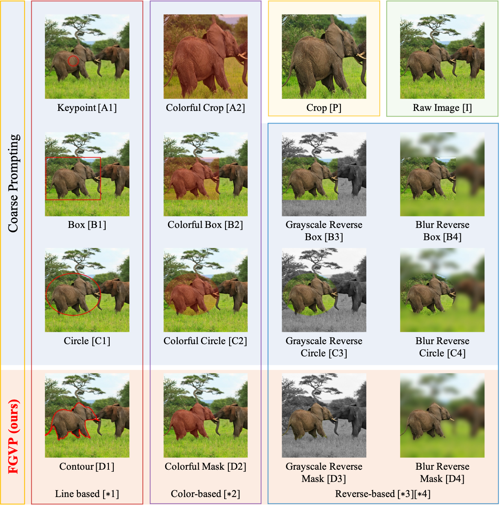

<h1>FGVP: Fine-Grained Visual Prompting</h1>

Official Codes for [Fine-Grained Visual Prompting](https://arxiv.org/abs/2306.04356), NeurIPS 2023

### Install
Our code is built upon [ReClip](https://arxiv.org/abs/2204.05991). The installation instructions and the preparation of datasets are the same as the [ReClip repository](https://github.com/allenai/reclip).

### FGVP

 

A Summary of visual prompts with the caption "elephant on the left".

 

### Results

| Method      | VLM               |  Visual Prompt  | Post Processing |                               Command                                | RefCOCO val | RefCOCO+ val | RefCOCOg val |
| :---------- | :---------------- | :-------------: | :-------------: | :------------------------------------------------------------------: | :---------: | :----------: | :----------: |
| CPT-adapted | ViT-B/32, RN50x16 |      $B2$       |        R        |    [link](https://github.com/ylingfeng/FGVP/blob/main/fgvp-reclip/cmds/ViT-B-32%2CRN50x16/run_R_cpt_adapted.py)    |    41.3     |     41.3     |     51.3     |
| ReCLIP      | ViT-B/32, RN50x16 | $P{\ \| \ }B4$  |        R        |      [link](https://github.com/ylingfeng/FGVP/blob/main/fgvp-reclip/cmds/ViT-B-32%2CRN50x16/run_R_reclip.py)       |    45.8     |     47.9     |     59.3     |
| RedCircle   | ViT-B/32, RN50x16 | $P{\  \| \ }C1$ |        R        |    [link](https://github.com/ylingfeng/FGVP/blob/main/fgvp-reclip/cmds/ViT-B-32%2CRN50x16/run_R_red_circle.py)     |    43.9     |     45.3     |     57.3     |
| FGVP (ours) | ViT-B/32, RN50x16 | $P{\  \| \ }D4$ |        R        | [link](https://github.com/ylingfeng/FGVP/blob/main/fgvp-reclip/cmds/ViT-B-32%2CRN50x16/run_R_blur_reverse_mask.py) |  **52.0**   |   **53.3**   |   **62.1**   |
| RedCircle (reported in paper) | ViT-L/14@336px, RN50x16 |      $C1{\  \| \ }C3{\  \| \ }C4$       |        S        |                                          --                                          |    49.8     |     55.3     |     59.4     |
| RedCircle                     | ViT-L/14@336px, RN50x16 |      $C1{\  \| \ }C3{\  \| \ }C4$       |        S        |         [link](https://github.com/ylingfeng/FGVP/blob/main/fgvp-reclip/cmds/ViT-L-14%40336px%2CRN50x16/run_S_red_circle.py)          |    51.4     |     56.3     |     58.3     |
| FGVP (ours)                   | ViT-L/14@336px, RN50x16 |      $D1{\  \| \ }D3{\  \| \ }D4$       |        S        |      [link](https://github.com/ylingfeng/FGVP/blob/main/fgvp-reclip/cmds/ViT-L-14%40336px%2CRN50x16/run_S_blur_reverse_mask.py)      |    52.9     |     57.4     |     58.1     |
| RedCircle                     | ViT-L/14@336px, RN50x16 | $P{\  \| \ }C1{\  \| \ }C3{\  \| \ }C4$ |        S        |     [link](https://github.com/ylingfeng/FGVP/blob/main/fgvp-reclip/cmds/ViT-L-14%40336px%2CRN50x16/run_S_red_circle_ensemble.py)     |    51.6     |     58.1     |     60.0     |
| FGVP (ours)                   | ViT-L/14@336px, RN50x16 | $P{\  \| \ }D1{\  \| \ }D3{\  \| \ }D4$ |        S        | [link](https://github.com/ylingfeng/FGVP/blob/main/fgvp-reclip/cmds/ViT-L-14%40336px%2CRN50x16/run_S_blur_reverse_mask_ensemble.py)  |    53.9     |     59.3     |     61.0     |
| RedCircle                     | ViT-L/14@336px, RN50x16 | $P{\  \| \ }C1{\  \| \ }C3{\  \| \ }C4$ |       RS        |    [link](https://github.com/ylingfeng/FGVP/blob/main/fgvp-reclip/cmds/ViT-L-14%40336px%2CRN50x16/run_RS_red_circle_ensemble.py)     |    56.8     |     58.6     |     62.2     |
| FGVP (ours)                   | ViT-L/14@336px, RN50x16 | $P{\  \| \ }D1{\  \| \ }D3{\  \| \ }D4$ |       RS        | [link](https://github.com/ylingfeng/FGVP/blob/main/fgvp-reclip/cmds/ViT-L-14%40336px%2CRN50x16/run_RS_blur_reverse_mask_ensemble.py) |  **59.6**   |   **60.0**   |   **63.3**   |

